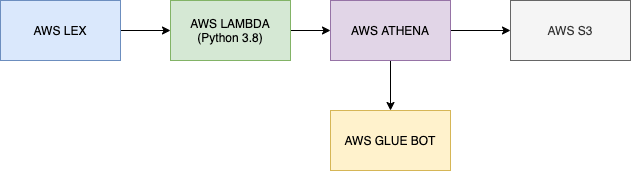
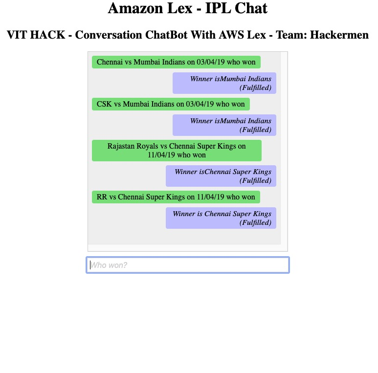

## AWS Lex IPL Chatbot

This Bot was originally developed for VIT Hack 2020. Team: Hackermen.

### What is AWS Lex?

AWS Lex is Amazon's chat bot creation service for building conversational interfaces using voice and text. It powers Amazon Alexa. It is now available for public use as an tool under the arsenal of AWS services.

### IPL ChatBot

This particular basic version of the chatbot can handle conversations on IPL (Indian Premier League Cricket). It can answer questions about previous matches from 2017-2019 seasons.

### Stack

The idea is to create a chat bot that is able to look up facts  about previous matches (prior to the IPL 2019 season) and also possibly predict the outcome of a future matchup between 2 teams.

By using AWS Lex we were able to work on the intents of the end user queries and actual entities that are needed/associated with the intent to look up the data. By using AWS Lambda, this previous data is packaged and available as an events object in Lambda.
We connect and configure the Chatbot based on the intent and the slots defined by Lex. The CSV Data is placed under Amazon S3 (under a public bucket). With Amazon Glue we are able to create a crawler that maps the schema of the CSV file into a table. With Athena, we then use SQL queries to retrieve and manage the data for the different conversations (dialogs) from the Dataset. 

Using a handler lambda function (runs Python 3.8), we were able to handle intents and push back the response to lex (guides the dialog flow)

### Future Results Prediction

We have designed a model that based on past data tells us in a match between 2 teams who would win the match based on several factors from the dataset. Here the model would render 2 outputs. One for when either teams wins the toss.

For example: 

The resultant output would be such that:
“if teamA wins the toss, then teamB will most likely win the match”,

“If teamB wins the toss, then teamB will most likely win the match”

### Machine Learning

The prediction is based on factors such as:
City, Venue Location, Toss Decision, Toss Winner and the previous year’s winner from the dataset.
We have used the XGBoost model, this is a gradient boosting type model, we used this model over the usual random forest model for its efficient performance so that we could convert the model into a scalable ML API. We trained it and saved its dump, so then our API could just call this dump and make a prediction over training the model all over again.

API link: https://vithack-predictor.herokuapp.com/predict?team1=MI&team2=CSK

### Chatbot UI

